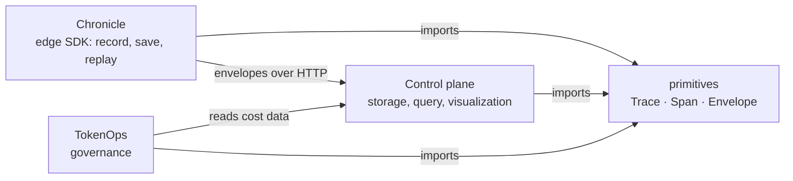

<div align="center">

# AgentPlane Primitives

**One schema for every agent trace.**<br>
<sub>Shared, versioned Trace, Span and Envelope models for Chronicle, the control plane and TokenOps.</sub>

[](https://github.com/theagentplane/primitives/actions/workflows/ci.yml)
[](https://github.com/theagentplane/primitives)
[](LICENSE)
[](https://peps.python.org/pep-0561/)
[](https://github.com/theagentplane/primitives/stargazers)
[](https://www.linkedin.com/company/the-agent-plane/)

<sub>Built by <b><a href="https://www.linkedin.com/in/susheemkoul/">Susheem Koul</a></b> and <b><a href="https://www.linkedin.com/in/tisha-chawla/">Tisha Chawla</a></b></sub>

<br>

[Core features](#-core-features) · [Quickstart](#-quickstart) · [How it fits](#-how-it-fits) · [Scope](#-scope) · [Versioning](#-versioning) · [Development](#-development) · [Support](#-support)

</div>

> ### 🚧 Pre-alpha
>
> This release is the repository scaffold. The models land in follow-up releases (see the
> [roadmap](#-roadmap)). Everything under *Core features* describes the
> [design](docs/design.md) these releases implement.

## ✨ Core features

Chronicle records what an agent did, the control plane stores and shows it, and TokenOps reads
it to govern spend. Those three only work together if they agree on the shape of the data.
This package is that agreement, and nothing else.

| | |
|---|---|
| **Three tiers** | A `Trace` is one request across services, a `Span` is one service's handling of it, an `Envelope` is one boundary crossing inside the span. |
| **One definition, three repos** | Chronicle, the control plane and TokenOps import the same models. None defines its own copy. |
| **Closed enums** | `kind`, `state`, `status` and the other enumerations are closed sets. A new value is a deliberate schema change. |
| **Additive-only versioning** | SemVer for the package plus a `schema_version` on every payload. Nothing breaks within a major version. |
| **W3C `traceparent` carrier** | Parse and format the trace-context header so a trace follows a request across services. |
| **No I/O, one dependency** | Data and validation only, on pydantic. No network, no disk, no business logic. |
| **Contract you can read** | Generated JSON Schema, committed and checked in CI, for anything that is not Python. |

## 🚀 Quickstart

Requires Python 3.10+. The package is typed ([PEP 561](https://peps.python.org/pep-0561/)).

```bash
pip install agentplane-primitives   # once the first release is published
```

Until then, install from source:

```bash
git clone https://github.com/theagentplane/primitives.git
cd primitives
pip install -e .
python -c "import agentplane_primitives as p; print(p.__version__)"
```

### When you need more

| You want to | Go to |
|---|---|
| Understand the entities and why there are three tiers | [Design](docs/design.md) |
| Know what may change between versions | [Versioning policy](docs/versioning.md) |
| Propose a new field or enum value | [Schema change proposal](https://github.com/theagentplane/primitives/issues/new?template=schema_change.yml) |
| Add a model | [Contributing](CONTRIBUTING.md) |
| Publish a release | [Releasing](RELEASING.md) |

## 🧩 How it fits



The control plane owns the schema, and this package is where that schema is defined and shared.
Chronicle never talks to a database. It sends envelopes to the control plane, which keeps its own
storage layout and maps from these models.

## 🎯 Scope

| In scope | Out of scope |
|---|---|
| `Trace`, `Span`, `Envelope` and their `llm` and `tool` payload variants | Storage, HTTP clients or servers |
| The `traceparent` carrier, id generation and validation | Business logic (pricing, policy, replay matching) |
| Enumerations and well-known metadata keys | Visualization or export (the control plane maps to OpenTelemetry) |
| Committed JSON Schema for every model | HTTP request and response wrappers (the control plane owns them, [ADR 0003](docs/adr/0003-api-models-live-in-control-plane.md)) |
| | Anything that performs I/O |

## 🔖 Versioning

SemVer for the package, plus a `schema_version` (`major.minor`) on every payload.

- **Additive-only within a major.** New optional fields are allowed. A new enum member is
  additive for the writer, but older readers reject it, so **consumers upgrade before emitters**.
- **A breaking change is a new major.** The control plane accepts the current and previous major.
- **Pre-1.0:** pin the exact minor. From 1.0: `>=1.2,<2`.

Full policy: [docs/versioning.md](docs/versioning.md).

## 🛠 Development

Uses [uv](https://docs.astral.sh/uv/).

```bash
uv sync                                   # environment with the dev group
uv run pytest --cov                       # tests
uv run ruff check . && uv run ruff format --check .
uv run mypy                               # strict type check
uv build                                  # sdist and wheel
```

## 🗺 Roadmap

1. ✅ Repository scaffold
2. `Trace`, `Span`, `Envelope`, the `llm` and `tool` payload variants, enums, ids
3. The `traceparent` carrier
4. Committed JSON Schema and the CI drift check

## Reference

<details>
<summary><b>Project structure</b></summary>

```
src/agentplane_primitives/   # installable package (typed; version in _version.py)
├── enums/                   # closed lists, one file each: kind, state, status, link type
├── types/                   # field types: id types, metadata key and label types
├── models/                  # the models: base class now; Trace, Span, Envelope to come
├── utils/                   # helper functions: id generation, reserved-key check (traceparent later)
└── schemas/                 # generated JSON Schema, committed and drift-checked in CI
                             # (more models and the traceparent carrier arrive in later PRs)
docs/                        # design notes and the versioning policy
tests/                       # unit tests
.github/                     # CI, release, dependency updates, templates
```

</details>

<details>
<summary><b>More documentation</b></summary>

- [Design](docs/design.md): the entities and where they are specified
- [Versioning policy](docs/versioning.md)
- [Changelog](CHANGELOG.md): every change classified as compatible or breaking
- [Contributing](CONTRIBUTING.md) - [Releasing](RELEASING.md) - [Security](SECURITY.md)

</details>

## 🛟 Support

| Need | Where |
|---|---|
| Bug | [Open an issue](https://github.com/theagentplane/primitives/issues) |
| Schema change | [Schema change proposal](https://github.com/theagentplane/primitives/issues/new?template=schema_change.yml) |
| Security issue | [SECURITY.md](SECURITY.md) |
| Real-time help | [Slack](https://join.slack.com/t/theagentplane/shared_invite/zt-47lqx2xtc-0idr1cuLNJ_JDTgqxDiUsg) |
| Talk it through | [Office hours](https://calendly.com/theagentplane/theagentplane) |

## Contributors

Thanks to everyone who has contributed.

[](https://github.com/theagentplane/primitives/graphs/contributors)

---

<div align="center">

[Back to top](#agentplane-primitives)

</div>
